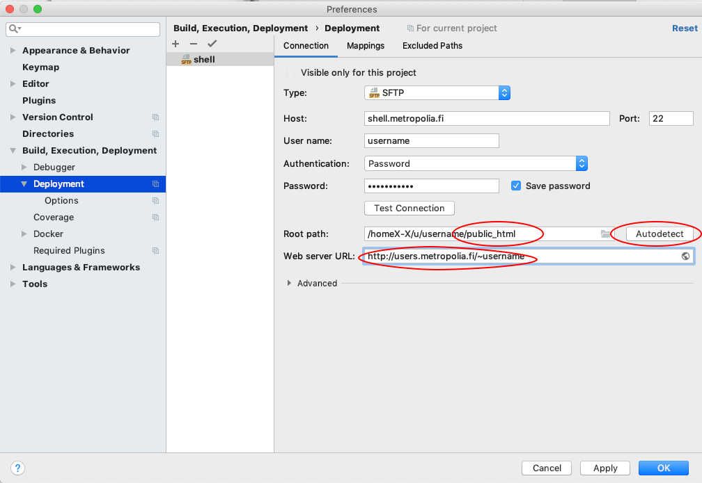
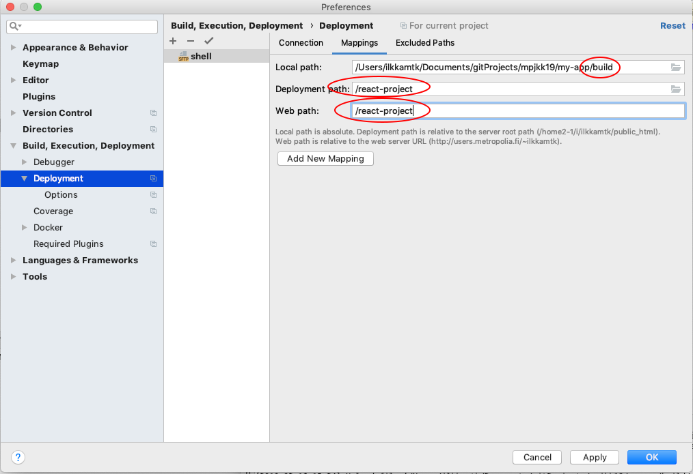
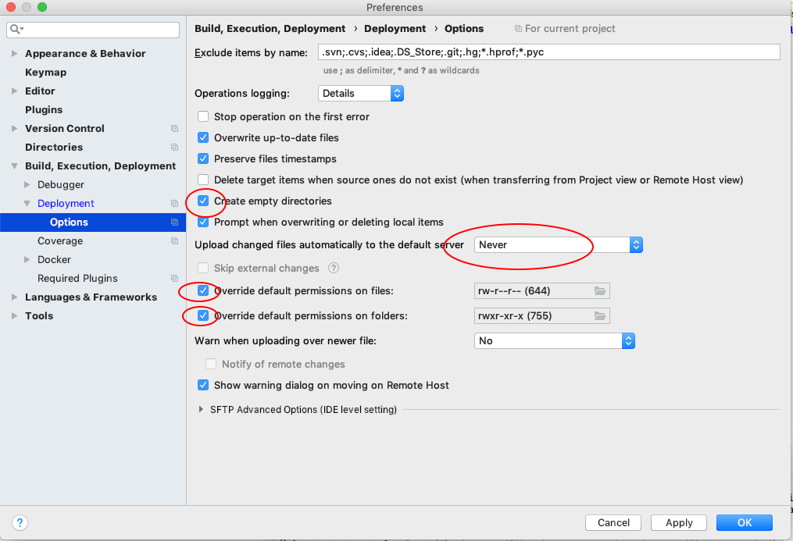

class: center, middle

# WBMA, First App

## 1/2019

---
# Exercise 1: Setup your toolchain and a new React project

Study [React crash course](https://www.youtube.com/watch?v=sBws8MSXN7A) from 0:00 to 39:52

### Exercise

**a.**

Check: [Create React App](https://github.com/facebook/create-react-app)

1. If needed, install code editor (+ extensions), git, npm
1. Use the `create-react-app` cli tool to generate an app skeleton `npx create-react-app my-app`
1. Test that app works; run it and open in browser
   - `cd my-app`
   - `yarn start`
1. Create a remote git repository and push your app there

**b.**  
1. Install ESlint to your project `yarn add -D eslint@5.12.0 eslint-plugin-react eslint-config-google`
1. Initialize ESlint: `yarn eslint --init` or `node eslint --init` or `./node_modules/.bin/eslint --init` or `node node_modules\eslint\bin\eslint.js --init`
    * Choose:
        1. To check syntax, find problems, and enforce code style
        1. JavaScript modules (import/export)
        1. React 
        1. Browser
        1. Use a popular style guide
        1. Google
        1. JavaScript
        1. n (because already installed)
1. Enable ESLint in your WebStrom project
   - [Instructions](https://www.jetbrains.com/help/webstorm/eslint.html)
1. Modify .eslintrc.js:
   ```JavaScript
    module.exports = {
      'parser': 'babel-eslint',
      'env': {
        'browser': true,
        'es6': true,
      },
      'extends': [
        'google',
        'eslint:recommended',
        'plugin:react/recommended',
      ],
      'globals': {
        'Atomics': 'readonly',
        'SharedArrayBuffer': 'readonly',
      },
      'parserOptions': {
        'ecmaFeatures': {
          'jsx': true,
        },
        'ecmaVersion': 2018,
        'sourceType': 'module',
      },
      'plugins': [
        'react',
      ],
      'rules': {
        'react/jsx-uses-react': 'error',
        'react/jsx-uses-vars': 'error',
        'no-console': 0,
      },
      'settings': {
        'react': {
          'createClass': 'createReactClass', // Regex for Component Factory to use,
                                             // default to "createReactClass"
          'pragma': 'React',  // Pragma to use, default to "React"
          'version': 'detect', // React version. "detect" automatically picks the version you have installed.
                               // You can also use `16.0`, `16.3`, etc, if you want to override the detected value.
                               // default to latest and warns if missing
                               // It will default to "detect" in the future
          'flowVersion': '0.53', // Flow version
        },
        'propWrapperFunctions': [
          // The names of any function used to wrap propTypes, e.g. `forbidExtraProps`. If this isn't set, any propTypes wrapped in a function will be skipped.
          'forbidExtraProps',
          {'property': 'freeze', 'object': 'Object'},
          {'property': 'myFavoriteWrapper'},
        ],
        'linkComponents': [
          // Components used as alternatives to <a> for linking, eg. <Link to={ url } />
          'Hyperlink',
          {'name': 'Link', 'linkAttribute': 'to'},
        ],
      },
    };
   ```
1. If you want to lint a certain file: `yarn eslint src/App.js` or `./node_modules/.bin/eslint src/App.js`.
1. You can correct code automatically with ctr-alt-l (remember to choose Google style form settings(preferences)/editor/code style/javascript first)

**c.**

1. Develop your app further. Add a `<table>` to the app skeleton so that the layout is similar to this: 

    

1. You can use placekitten.com or similar site for the images
1. Example html:
    ```html
    <table>
        <tbody>
           <tr>
               <td>
                   
                </td>
               <td>
                   <h3>Title</h3>
                   <p>Lorem ipsum dolor sit amet...</p>
               </td>
               <td>
                   <a href="#">View</a>
                </td>
             </tr>
        </tbody> 
    </table>

    ```

**d.**

1. Develop your app further. Make the table dynamically by using this array:
    ```javascript
    // add to App.js
      
    state = 
     picArray: [
        {
          'title': 'Title 1',
          'description': 'Lorem ipsum dolor sit amet, consectetur adipiscing elit. Duis sodales enim eget leo condimentum vulputate. Sed lacinia consectetur fermentum. Vestibulum lobortis purus id nisi mattis posuere. Praesent sagittis justo quis nibh ullamcorper, eget elementum lorem consectetur. Pellentesque eu consequat justo, eu sodales eros.',
          'thumbnails': {
               w160: 'http://placekitten.com/160/161'
            },
          'filename': 'http://placekitten.com/2048/1920',
        },
        {
          'title': 'Title 2',
          'description': 'Donec dignissim tincidunt nisl, non scelerisque massa pharetra ut. Sed vel velit ante. Aenean quis viverra magna. Praesent eget cursus urna. Ut rhoncus interdum dolor non tincidunt. Sed vehicula consequat facilisis. Pellentesque pulvinar sem nisl, ac vestibulum erat rhoncus id. Vestibulum tincidunt sapien eu ipsum tincidunt pulvinar. ',
          'thumbnails': {
               w160: 'http://placekitten.com/160/162'
           },
          'filename': 'http://placekitten.com/2041/1922',
        },
        {
          'title': 'Title 3',
          'description': 'Phasellus imperdiet nunc tincidunt molestie vestibulum. Donec dictum suscipit nibh. Sed vel velit ante. Aenean quis viverra magna. Praesent eget cursus urna. Ut rhoncus interdum dolor non tincidunt. Sed vehicula consequat facilisis. Pellentesque pulvinar sem nisl, ac vestibulum erat rhoncus id. ',
          'thumbnails': {
               w160: 'http://placekitten.com/160/163'
           },
          'filename': 'http://placekitten.com/2039/1920',
        },
      ];
    ```

1. Create components for table, tbody and tr.
    * Hierarchy:
    ```text
    App
       -table
           -tbody
               -tr
               -tr
               ...
 
    ```
    * you can put each comoponent (table, tbody, tr) to one file or you can make own file for each component 
    * Pass picArray as props from App to table to tbody.
    * Iterate picArray in tbody to create multiple tr components
    
1. Develop your app further. Open 'filename' image when `<a>` is clicked.
1. (Optional) Develop your app further. Add more CSS. For example open 'filename' image to your self made modal.
1. git add, commit & push to remote repository
1. Deploy project to your public_html (see below for instructions)

---

## Deploy React Project

1. Add following to package.json (e.g after devDependencies):
    ```json
     "homepage": "."
    ```
1. Run `yarn build`
1. Set deployment settings in WebStorm:
    
    
    
1. Move build folder to your public_html