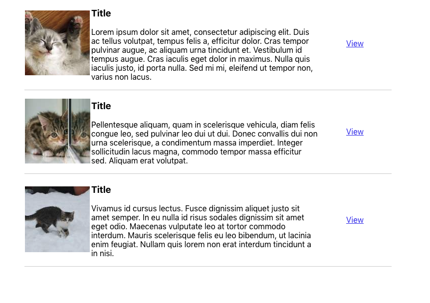

class: center, middle

# WBMA, First App

## 1/2019

---
# Exercise 1: Setup your toolchain and a new React project

**a.**

Check: [Create React App](https://github.com/facebook/create-react-app)

1. If needed, install code editor (+ extensions), git, npm
1. Use the `create-react-app` cli tool to generate an app skeleton `npx create-react-app my-app`
1. Test that app works; run it and open in browser
   - `cd my-app`
   - `yarn start`
1. Create a remote git repository and push your app there

**b.**  
1. Install ESlint to your project `yarn add -D eslint eslint-plugin-react eslint-config-google`
1. Initialize ESlint: `yarn eslint --init`
    * Choose:
        1. To check syntax, find problems, and enforce code style
        1. JavaScript modules (import/export)
        1. React 
        1. Browser
        1. Use a popular style guide
        1. Google
        1. JSON
        1. n (because already installed)
1. [Enable ESLint in your project](https://www.jetbrains.com/help/webstorm/eslint.html)
   - Modify .eslintrc.json:
   ```json
    "extends": [
       "google",
       "eslint:recommended",
       "plugin:react/recommended"
     ],
   ```
1. If you want to lint a certain file: `yarn eslint src/App.js`.
1. You can correct code automatically with ctr-alt-l (remember to choose Google style form settings(preferences)/editor/code style/javascript first)

**c.**

1. Develop your app further. Add a list to the app skeleton so that the layout is similar to this: 

    
1. Develop your app further. Make the list dynamically by using this array and *ngFor:
    ```typescript
    // add this to home.ts before @Component
    class Pic {
      constructor(
        public title: string,
        public details: string,
        public thumbnail: string,
        public original: string,
      ) {
      }
    
    }
    
    // add this to HomePage component
    picArray: Pic[] = [
        {
          'title': 'Title 1',
          'details': 'Lorem ipsum dolor sit amet, consectetur adipiscing elit. Duis sodales enim eget leo condimentum vulputate. Sed lacinia consectetur fermentum. Vestibulum lobortis purus id nisi mattis posuere. Praesent sagittis justo quis nibh ullamcorper, eget elementum lorem consectetur. Pellentesque eu consequat justo, eu sodales eros.',
          'thumbnail': 'http://placekitten.com/310/302',
          'original': 'http://placekitten.com/2048/1920',
        },
        {
    
          'title': 'Title 2',
          'details': 'Donec dignissim tincidunt nisl, non scelerisque massa pharetra ut. Sed vel velit ante. Aenean quis viverra magna. Praesent eget cursus urna. Ut rhoncus interdum dolor non tincidunt. Sed vehicula consequat facilisis. Pellentesque pulvinar sem nisl, ac vestibulum erat rhoncus id. Vestibulum tincidunt sapien eu ipsum tincidunt pulvinar. ',
          'thumbnail': 'http://placekitten.com/321/300',
          'original': 'http://placekitten.com/2041/1922',
        },
        {
          'title': 'Title 3',
          'details': 'Phasellus imperdiet nunc tincidunt molestie vestibulum. Donec dictum suscipit nibh. Sed vel velit ante. Aenean quis viverra magna. Praesent eget cursus urna. Ut rhoncus interdum dolor non tincidunt. Sed vehicula consequat facilisis. Pellentesque pulvinar sem nisl, ac vestibulum erat rhoncus id. ',
          'thumbnail': 'http://placekitten.com/319/301',
          'original': 'http://placekitten.com/2039/1920',
        },
      ];
    ```
1. Develop your app further. Open 'original' image when 'view'-button is clicked.
   - Use [PhotoViever](https://ionicframework.com/docs/native/photo-viewer/) plugin to display the selected image
   ```sh
    ionic cordova plugin add com-sarriaroman-photoviewer@1.1.18
    npm install --save @ionic-native/photo-viewer@4
    ```
    - In home.html add (click)-event which calls for your own made method that starts PhotoViewer 
    - Ionic Native Plugins are providers, so you have to add PhotoViewer as a provider to app.module.ts
    - Needs to be run with emulator
    - Result:
    
    
1. Develop your app further. Add content (text, images) and more CSS.
1. git add, commit & push to remote repository 

---
