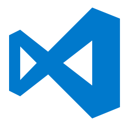

class: center, middle

# Mobile Web Development Toolchain

## 1/2019

---

# Contents

- Editor/IDE: WebStrom/PhpStorm, Visual Studio Code, (or any)
- Language: TypeScript
- Run, test & debug: Chrome browser dev tools, Safari browser dev tools
- Version Control System: Git
- Package manager: NPM
- Building & automating tasks: Ionic CLI
- Development frameworks: Ionic (Angular for application logic)
- Creating a native (hybrid) app: Ionic (Cordova)

---

# Code editor or IDE

Ultimately, it's your choice. WebStrom/PhpStorm is recommended.

#### WebStorm/PhpStorm

- free for Metropolia students. [Apply for license here](https://www.jetbrains.com/student/)
  - _@metropolia.fi_ email address needed for a free license
- full featured IDE
- quite ready out of the box. No need for plugins.
- based on IntelliJ IDEA, just like Android Studio

#### Visual Studio Code

- free & open source code editor by Microsoft (**!=** Visual Studio IDE)
- wide extension support
- lightweight, multiplatform support
- good [docs & instructions](https://code.visualstudio.com/docs/editor/codebasics)
- choice of many Angular developers

#### Other picks

- [Atom](https://atom.io/)
- [Brackets](http://brackets.io/)
- Other IDEs like: IntelliJ Ultimate IDEA, Eclipse, NetBeans... 

---

# Browser & debugging

- Chrome & [Chrome DevTools](https://developers.google.com/web/tools/chrome-devtools/)
- Safari & [Safari Develop menu](https://support.apple.com/guide/safari/use-the-developer-tools-in-the-develop-menu-sfri20948/mac)
- Enable [USB Debugging Mode on Android](https://www.kingoapp.com/root-tutorials/how-to-enable-usb-debugging-mode-on-android.htm)


---

# Source Code Management - Git

Check [Git stuff](https://github.com/mattpe/git-intro/blob/master/git-basics.md)

What files to include in repo?

- all source code
- README.md and other documentation
- eg. npm grunt or bower settings files
- .gitignore file: list of local stuff not to be included in the version control ->

Exclude:

- IDE specific project files & folders
- build targets and other automatically generated files
- packages managed e.g. by npm or bower (= _node_modules/_ & _bower_components/_ folders) 
- any temp & OS specific files, like Apple's `.DS_Store` 

Ionic CLI generates a .gitignore file automatically.

---

# Package Management

## [NPM](https://www.npmjs.com/) - Node.js Package Manager

- Install [node.js](https://nodejs.org/en/) to get the package manager **npm**
- npm packages needed in a project (dependencies) are listed in the `package.json` file and can be install with `npm install` command
- locally installed (=project specific) packages are downloaded to `node_modules/` folder (should be excluded from version control)

#### OS X no sudo

- [instructions](https://github.com/sindresorhus/guides/blob/master/npm-global-without-sudo.md)

#### NPM Alternative

[Yarn](https://yarnpkg.com/) 

- newcomer gaining a lot of traction now
- first [open source release on October, 2016](https://code.facebook.com/posts/1840075619545360). Current version 0.18.1 
- uses same package.json file and npm registry as npm
- claimed to be faster, more secure and reliable

---

# Example package.json

```javascript
{
  "name": "example-app",
  "version": "0.0.1",
  "author": "Example Coder <ecoder@example.com>",
  "description": "An example app doing something",
  "license": "MIT",
  "scripts": {
    "start": "node ./app.js"
  },
  "dependencies": {
    "@angular/common": "~2.1.0",
    "@angular/core": "~2.1.0"
  }        }
}

```

---

# Automating Development Tasks

**[ionic-cli](https://ionicframework.com/docs/cli/commands.html) command line tool** - `ionic` command:

- Run frequent routine tasks in development workflow easily
- Create an app skeleton
- Generate app components 
- Run development server enviroment
- Run tests, validate code
- Build/Deploy application
  - Minify & combine source files
  - Remove comments & other extra stuff not needed in production version

---

# Frameworks used

## Front-end application logic & Layout HTML/CSS components & Hybrid app

[Ionic](https://ionicframework.com/) 

---

# From web page to native app

## Hybrid App

- Written in HTML/CSS/JS
- Wrapped to native app using packaging tool
- [Apache Cordova](https://cordova.apache.org/)
  - Create mobile apps with HTML, CSS & JS
- [Ionic Framework](http://ionicframework.com)
  - uses Cordova for building
  - utilizes Angular for application logic
  - has it's own HTML/CSS [components](https://ionicframework.com/docs/components/)

---

class: center, middle

# Getting Started with WebStorm

---

# Install WebStorm

Download & install [WebStorm](https://www.jetbrains.com/webstorm/)
        
.center[]

---

# WebStorm settings
- [Accessing default settings](https://www.jetbrains.com/help/webstorm/accessing-default-settings.html)
- [Change JavaScript version to ES6](https://www.jetbrains.com/help/webstorm/javascript.html#ws_js_choose_language_version). Do this in (also) in default settings.
- Set JavaScript code style (editor/code style/JavaScript) to Google JavaScript Style Guide
- Set TypeScript code style (editor/code style/TypeScript) to JavaScript
---

# Getting Started with VSCode

---
        
# Install VSCode

Download & install [Visual Studio Code](https://code.visualstudio.com/)
        
.center[]

---

# Install Extensions

Press _ctrl-shift-x_ or click extensions icon on the left panel.

Search and install:

- Auto Import
- TSLint

Other handy extensions:

- EditorConfig for VS Code: support for [EditorConfig](http://editorconfig.org/)
- Duplicate file: Add _right-click -> Duplicate file_ action
    
---

# VSCode - Basic Usage

Active **project** is the folder open on the left side panel (_File -> Open folder..._) 

Handy keyboard shortcuts (finnish layout, check _File -> Preferences -> Keyboard shortcuts_ for more)        

- Multiline comment: _ctrl-'_
- Delete line: _ctrl-shift-k_
- Move line(s): _alt-up/down_
- Copy line(s): _alt-shift-up/down_
- Auto format code: _alt-shift-f_
- Open integrated console: _ctrl-ö_
- Quick find/open files: _ctrl-p_
- Split editor: _ctrl-§_

---

# VSCode - Settings

Change integrated console to Bash in Windows:

1. Install [Git for Windows](https://git-scm.com/downloads) to default location
2. Edit vscode settings file (_File -> Preferences -> User settings_) and add the following property into json object:

```js
// Place your settings in this file to overwrite the default settings
{
  "terminal.integrated.shell.windows": "C:\\Program Files\\Git\\bin\\bash.exe",
}
```

---

## Useful online material

Check [Readme file](https://github.com/mattpe/wbma) of this repo.
